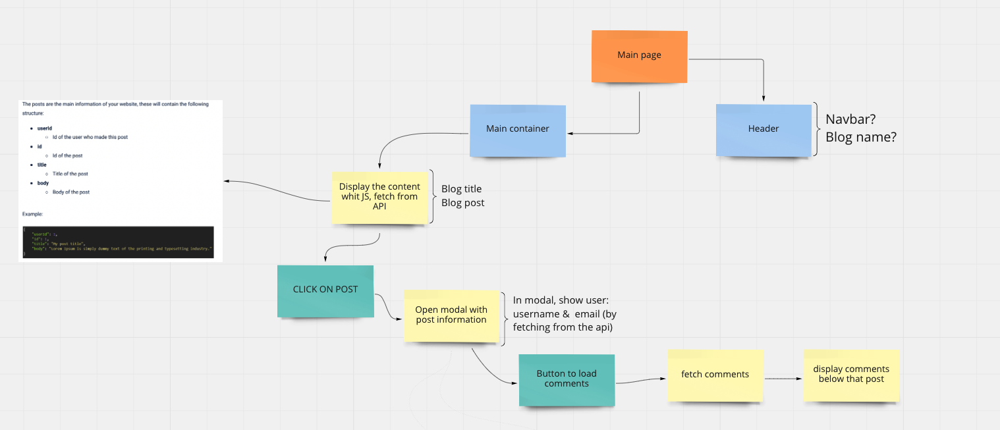
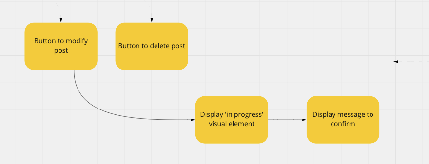
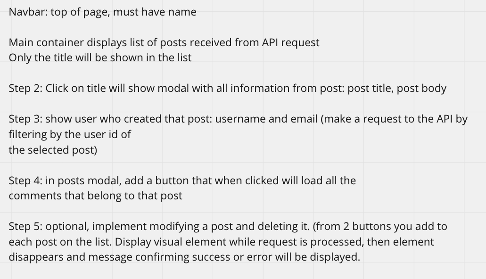

# News Blog with API 
Our blog adopts a design inspired by well-known newspapers and news websites, such as The Guardian, The Washington  Post, The New York Times. Our goal for the design focused on simplicity and functionality for the user.

It was important for us to be able to access different endpoints for the json.placeholder API. Although we did not incorporate POST and DELETE functions for the blog posts, the code is scalable and this implementation is planned for future versions.

## Planning

We began the project by outlining the project, using tools like Trello for workflow, as well as Figma and Miró for basic design plans.

Day 1 of the project was dedicated toward planning the functionality and design of the app. 

Day 2 began by setting up a local JSON server for testing, then moving on to basic HTML structure and Javascript functionality.

On Day 3, we focused on accessing the JSON data and displaying successfully on the main page, testing several methods, finally settling on *fetch*, using a mix of standard and async functions.

On Day 4, the design and visual aspect was improved by further integrating Bootstrap 5 classes into the HTML and Javascript. Then time was spent refactoring main functions.

## Requirements

*Use json.placeholder API with endpoints for users, comments, and posts. 
*Use fetch method for HTTP requests.
*Use Bootstrap to add style to the website.

## Attribution

Illustration on main page from Undraw (https://undraw.co/illustrations)
Icon on header by Icons8 (https://icons8.com)

## The Team

Alejandro Gaerste Steger (https://github.com/Gaerste/)
Blake Johnson (https://github.com/blakejohns5) 